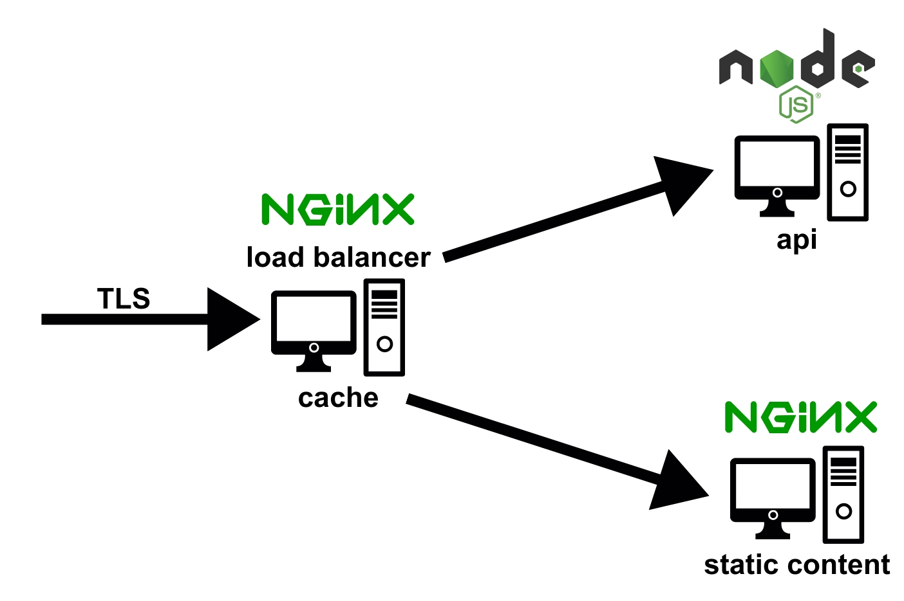

# Reverse Proxy, Cache and Load Balancer with Nginx



## Execution
1. Clone this repository
```
git clone https://github.com/vitor-msp/nginx.git
```

2. Access the downloaded folder
```
cd nginx
```

3. Run Docker Compose
```
docker-compose up -d
```

## Notes

1. Create the DNS entries below on your machine:
```
127.0.0.1 site.nginx
127.0.0.1 api.nginx
127.0.0.1 blue.api.nginx
127.0.0.1 green.api.nginx
```